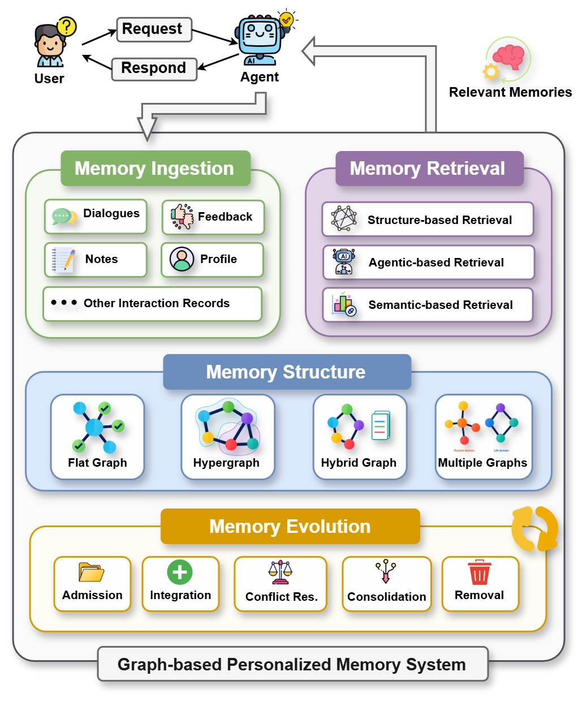
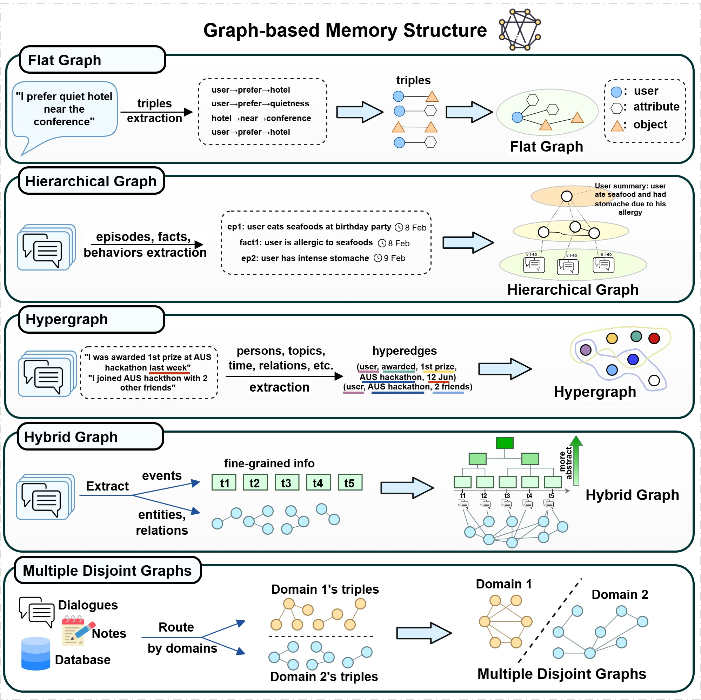
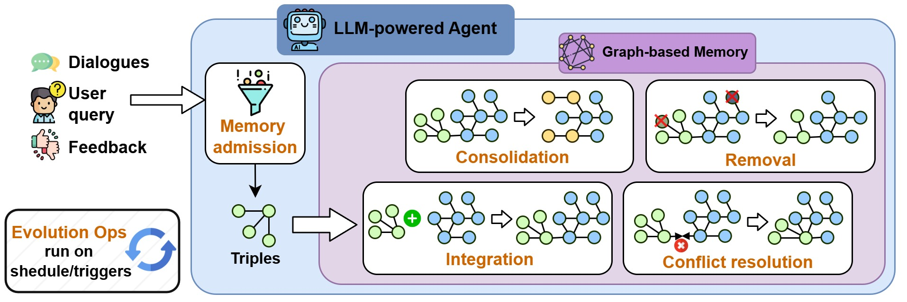

# Awesome Graph-Based Personalized Memory for LLM Agents

A curated list of papers, systems, and benchmarks on **graph-based personalized memory** for LLM agents.

Recent advances in large language models (LLMs) have enabled agents that can follow complex instructions, plan over multiple steps, use tools, and carry out long-horizon tasks. Building on these capabilities, such agents are increasingly deployed as personal assistants that interact with the same user across sessions, tasks, and contexts. In this setting, personalization becomes a central requirement: effective long-term assistance depends not only on general reasoning, but also on an understanding of the user's goals, preferences, constraints, relationships, and prior experiences.

The user-specific knowledge that personalization depends on is rarely stated in a single session. It accumulates gradually through repeated interaction and often changes over time. Although recent models support large context windows, replaying a user's full history in the prompt remains impractical. Personalized agents therefore require a persistent memory that can store this information across sessions, reorganize it as circumstances change, and retrieve it to guide subsequent behavior. Designs based on dialogue logs, summaries, or vector stores can recall individual entries, yet they leave relations, provenance, temporal validity, and contradictions implicit.

Graph-based memory provides a structured alternative. By representing user facts, episodes, and relations as nodes and edges, it can encode not only what an agent remembers about a user, but also how memories are connected, revised, and retrieved for personalized decisions. This repository collects recent work on this topic and organizes it along the memory lifecycle: **representation → evolution → retrieval → evaluation**.

## News

🔭 This project is under active development. Star and watch the repository to follow updates.

## Overview

This repository collects recent advances in graph-based personalized memory for LLM agents. We organize the literature around four stages of the memory lifecycle: representation, evolution, retrieval, and evaluation. The figure below summarizes this workflow, from ingesting user interactions to retrieving a bounded subgraph for the next response.

  

<em>Overview of a graph-based personalized agent memory system.</em>

We further include evaluation protocols and application-oriented systems. Adjacent GraphRAG and generic agent-memory work is listed separately when it provides useful context but falls outside the scope of personalized graph memory.

We hope this repository can help researchers and practitioners navigate this emerging area. Contributions of missing papers are welcome.

> [!NOTE]
> Papers often span more than one subsection. A work is listed under **every heading it illustrates**, so it can be found from the category a reader is looking for.

***

## 📌 Contents

* [News](#news)
* [Overview](#overview)
* [Overviews](#overviews)
  * [Core related surveys](#core-related-surveys)
  * [Broader surveys](#broader-surveys)
* [Personal Assistants](#personal-assistants)
* [Memory Representation](#memory-representation)
  * [Flat Graph](#flat-graph)
  * [Hierarchical Graph](#hierarchical-graph)
  * [Hypergraph](#hypergraph)
  * [Hybrid Graph](#hybrid-graph)
  * [Multiple Disjoint Graphs](#multiple-disjoint-graphs)
* [Memory Evolution](#memory-evolution)
  * [Admission](#admission)
  * [Integration](#integration)
  * [Conflict Resolution](#conflict-resolution)
  * [Consolidation](#consolidation)
  * [Removal](#removal)
* [Memory Retrieval](#memory-retrieval)
  * [Similarity-Based Retrieval](#similarity-based-retrieval)
  * [Structure-Based Retrieval](#structure-based-retrieval)
  * [Adaptive and Agentic Retrieval](#adaptive-and-agentic-retrieval)
* [Evaluation](#evaluation)
  * [Long-Horizon Recall](#long-horizon-recall)
  * [Personalization and User State](#personalization-and-user-state)
  * [Structure and Evolution](#structure-and-evolution)
* [Applications](#applications)
* [Adjacent / Out of Scope](#adjacent--out-of-scope)
  * [GraphRAG and data methods](#graphrag-and-data-methods)
* [Contributing](#-contributing)

***

## Overviews

Surveys that frame the area.

### Core related surveys

Personalized agents, graph-based agent memory, and modular agent memory — the three review lines the survey positions itself against.

| Work                                                                                                  | Links                                                                                                       |
| ----------------------------------------------------------------------------------------------------- | ----------------------------------------------------------------------------------------------------------- |
| **Graph-based Agent Memory: Taxonomy, Techniques, and Applications** (arXiv'26)                       | [\[paper\]](https://arxiv.org/abs/2602.05665) [\[code\]](https://github.com/DEEP-PolyU/Awesome-GraphMemory) |
| **Toward Personalized LLM-Powered Agents: Foundations, Evaluation, and Future Directions** (arXiv'26) | [\[paper\]](https://arxiv.org/abs/2602.22680)                                                               |
| **Memory in the LLM Era: Modular Architectures and Strategies in a Unified Framework** (arXiv'26)     | [\[paper\]](https://arxiv.org/abs/2604.01707)                                                               |

### Broader surveys

| Work                                                                                                                 | Links                                                                                          |
| -------------------------------------------------------------------------------------------------------------------- | ---------------------------------------------------------------------------------------------- |
| **A Survey on the Memory Mechanism of Large Language Model based Agents** (arXiv'24)                                 | [\[paper\]](https://arxiv.org/abs/2404.13501) [\[code\]](https://github.com/nuster1128/LLM_Agent_Memory_Survey) |
| **From Storage to Experience: A Survey on the Evolution of LLM Agent Memory Mechanisms** (ACL Findings'26)           | [\[paper\]](https://arxiv.org/abs/2605.06716)                                                   |
| **Graph-Augmented Large Language Model Agents: Current Progress and Future Prospects** (IEEE Intelligent Systems'26) | [\[paper\]](https://arxiv.org/abs/2507.21407)                                                   |
| **Large Language Model Agent: A Survey on Methodology, Applications and Challenges** (arXiv'25)                      | [\[paper\]](https://arxiv.org/abs/2503.21460)                                                   |
| **Memory in the Age of AI Agents** (arXiv'25)                                                                        | [\[paper\]](https://arxiv.org/abs/2512.13564)                                                   |
| **Personalized Generation In Large Model Era: A Survey** (ACL'25)                                                    | [\[paper\]](https://arxiv.org/abs/2503.02614)                                                   |

## Personal Assistants

Deployed personal, agentic assistants that motivate long-term memory.

| Work                                                                            | Links                                                                                                       |
| ------------------------------------------------------------------------------- | ----------------------------------------------------------------------------------------------------------- |
| **Dreaming: Better Memory for ChatGPT** (OpenAI Blog'26)                        | [\[link\]](https://openai.com/index/chatgpt-memory-dreaming/)                                               |
| **Hermes Agent**                                                                | [\[link\]](https://hermes-agent.nousresearch.com/) [\[code\]](https://github.com/NousResearch/hermes-agent) |
| **OpenClaw**                                                                    | [\[link\]](https://docs.openclaw.ai/) [\[code\]](https://github.com/openclaw/openclaw)                      |
| **Supermemory**                                                                 | [\[link\]](https://supermemory.ai/)                                                                         |
| **Vellum Assistant: A Personal AI Assistant That Evolves With You**             | [\[link\]](https://github.com/vellum-ai/vellum-assistant)                                                   |

## Memory Representation

How user facts, preferences, episodes, and relations are stored and structured with graphs. The papers below are grouped by **structure**.

  

<em>Representative graph-based memory patterns: flat, hierarchical, hypergraph, hybrid, and multiple disjoint graphs.</em>

> [!NOTE]
> The five patterns are not mutually exclusive. A system that combines patterns is listed under each pattern it uses.

### Flat Graph

User-related facts and relations as nodes and typed edges, without an explicit abstraction hierarchy. Heterogeneous types alone do not count as hierarchy.

| Work                                                                                                                     | Links                                         |
| ------------------------------------------------------------------------------------------------------------------------ | --------------------------------------------- |
| **Agentic Memory: Learning Unified Long-Term and Short-Term Memory Management for Large Language Model Agents** (ACL'26) | [\[paper\]](https://arxiv.org/abs/2601.01885) |
| **Beyond Dialogue Time: Temporal Semantic Memory for Personalized LLM Agents** (ACL'26)                                  | [\[paper\]](https://arxiv.org/abs/2601.07468) |
| **EchoGuard: An Agentic Framework with Knowledge-Graph Memory for Detecting Manipulative Communication in Longitudinal Dialogue** (arXiv'26) | [\[paper\]](https://arxiv.org/abs/2603.04815) |
| **Knowledge Graph Tuning: Real-time Large Language Model Personalization based on Human Feedback** (arXiv'24)            | [\[paper\]](https://arxiv.org/abs/2405.19686) |
| **Mem0: Building Production-Ready AI Agents with Scalable Long-Term Memory** (ECAI'25)                                   | [\[paper\]](https://arxiv.org/abs/2504.19413) |
| **MemORAI: Memory Organization and Retrieval via Adaptive Graph Intelligence for LLM Conversational Agents** (ACL Findings'26) | [\[paper\]](https://arxiv.org/abs/2605.01386) |
| **Memory Matters More: Event-Centric Memory as a Logic Map for Agent Searching and Reasoning** (ACL'26)                  | [\[paper\]](https://arxiv.org/abs/2601.04726) |
| **Time is Not a Label: Continuous Phase Rotation for Temporal Knowledge Graphs and Agentic Memory** (arXiv'26)           | [\[paper\]](https://arxiv.org/abs/2604.11544) |
| **User Memory Reasoning for Conversational Recommendation** (COLING'20)                                                  | [\[paper\]](https://arxiv.org/abs/2006.00184) |

### Hierarchical Graph

Evidence in layers (turns, facts, topics, personas) so user state is available at more than one granularity.

| Work                                                                                                                           | Links                                                                                          |
| ------------------------------------------------------------------------------------------------------------------------------ | ---------------------------------------------------------------------------------------------- |
| **A Simple Yet Strong Baseline for Long-Term Conversational Memory of LLM Agents** (arXiv'25)                                  | [\[paper\]](https://arxiv.org/abs/2511.17208)                                                  |
| **Agentic Recommender System with Hierarchical Belief-State Memory** (arXiv'26)                                                | [\[paper\]](https://arxiv.org/abs/2605.14401)                                                  |
| **Amory: Building Coherent Narrative-Driven Agent Memory through Agentic Reasoning** (EACL'26)                                 | [\[paper\]](https://arxiv.org/abs/2601.06282)                                                  |
| **AriGraph: Learning Knowledge Graph World Models with Episodic Memory for LLM Agents** (IJCAI'25)                             | [\[paper\]](https://arxiv.org/abs/2407.04363)                                                  |
| **Bi-Mem: Bidirectional Construction of Hierarchical Memory for Personalized LLMs via Inductive-Reflective Agents** (arXiv'26) | [\[paper\]](https://arxiv.org/abs/2601.06490)                                                  |
| **GAAMA: Graph Augmented Associative Memory for Agents** (arXiv'26)                                                            | [\[paper\]](https://arxiv.org/abs/2603.27910)                                                  |
| **GAM: Hierarchical Graph-based Agentic Memory for LLM Agents** (ACL'26)                                                       | [\[paper\]](https://arxiv.org/abs/2604.12285)                                                  |
| **G-Memory: Tracing Hierarchical Memory for Multi-Agent Systems** (NeurIPS'25)                                                 | [\[paper\]](https://arxiv.org/abs/2506.07398) [\[code\]](https://github.com/bingreeky/GMemory) |
| **Hierarchical Long-Term Semantic Memory for LinkedIn's Hiring Agent** (KDD'26)                                                | [\[paper\]](https://arxiv.org/abs/2604.26197)                                                  |
| **Hierarchical Memory Orchestration for Personalized Persistent Agents** (arXiv'26)                                            | [\[paper\]](https://arxiv.org/abs/2604.01670)                                                  |
| **Hindsight is 20/20: Building Agent Memory that Retains, Recalls, and Reflects** (arXiv'25)                                   | [\[paper\]](https://arxiv.org/abs/2512.12818)                                                  |
| **HyperMem: Hypergraph Memory for Long-Term Conversations** (ACL'26)                                                           | [\[paper\]](https://arxiv.org/abs/2604.08256)                                                  |
| **LEGOMem: Modular Procedural Memory for Multi-agent LLM Systems for Workflow Automation** (arXiv'25)                          | [\[paper\]](https://arxiv.org/abs/2510.04851)                                                  |
| **LOOM: Personalized Learning Informed by Daily LLM Conversations Toward Long-Term Mastery via a Dynamic Learner Memory Graph** (PerFM@AAAI'26) | [\[paper\]](https://arxiv.org/abs/2511.21037)                                                  |
| **SGMem: Sentence Graph Memory for Long-Term Conversational Agents** (arXiv'25)                                                | [\[paper\]](https://arxiv.org/abs/2509.21212)                                                  |
| **Zep: A Temporal Knowledge Graph Architecture for Agent Memory** (arXiv'25)                                                   | [\[paper\]](https://arxiv.org/abs/2501.13956)                                                  |

### Hypergraph

Joint context stored as hyperedges, representing more complex relationships.

| Work                                                                                                         | Links                                         |
| ------------------------------------------------------------------------------------------------------------ | --------------------------------------------- |
| **HingeMem: Boundary Guided Long-Term Memory with Query Adaptive Retrieval for Scalable Dialogues** (WWW'26) | [\[paper\]](https://arxiv.org/abs/2604.06845) |
| **HyperMem: Hypergraph Memory for Long-Term Conversations** (ACL'26)                                         | [\[paper\]](https://arxiv.org/abs/2604.08256) |

### Hybrid Graph

A graph for relations, plus a complementary store (tree, summaries, passages, or evidence buffer).

| Work                                                                                                           | Links                                         |
| -------------------------------------------------------------------------------------------------------------- | --------------------------------------------- |
| **H-Mem: A Novel Memory Mechanism for Evolving and Retrieving Agent Memory via a Hybrid Structure** (arXiv'26) | [\[paper\]](https://arxiv.org/abs/2605.15701) |
| **LiCoMemory: Lightweight and Cognitive Agentic Memory for Efficient Long-Term Reasoning** (ACL'26)            | [\[paper\]](https://arxiv.org/abs/2511.01448) |
| **MemCog: From Memory-as-Tool to Memory-as-Cognition in Conversational Agents** (arXiv'26)                     | [\[paper\]](https://arxiv.org/abs/2605.28046) |
| **MemWeaver: Weaving Hybrid Memories for Traceable Long-Horizon Agentic Reasoning** (ACL'26)                   | [\[paper\]](https://arxiv.org/abs/2601.18204) |

### Multiple Disjoint Graphs

Separate graph instances for different timescales or functions.

| Work                                                                                                                                  | Links                                         |
| ------------------------------------------------------------------------------------------------------------------------------------- | --------------------------------------------- |
| **DEMENTIA-PLAN: An Agent-Based Framework for Multi-Knowledge Graph Retrieval-Augmented Generation in Dementia Care** (KGPPH@AAAI'25) | [\[paper\]](https://arxiv.org/abs/2503.20950) |

## Memory Evolution

How the graph is updated: whether to write, how to attach, how to handle conflict, how to reorganize, whether to consolidate to avoid memory bloat, and how to forget or delete.

  

<em>Evolution of graph-based personalized memory: admission, integration, conflict resolution, consolidation, and removal.</em>

### Admission

Whether incoming evidence becomes persistent memory, and at what type or granularity.

| Work                                                                                                                           | Links                                         |
| ------------------------------------------------------------------------------------------------------------------------------ | --------------------------------------------- |
| **Knowledge Graph Tuning: Real-time Large Language Model Personalization based on Human Feedback** (arXiv'24)                  | [\[paper\]](https://arxiv.org/abs/2405.19686) |
| **MemGuard: Preventing Memory Contamination in Long-Term Memory-Augmented Large Language Models** (arXiv'26)                   | [\[paper\]](https://arxiv.org/abs/2605.28009) |
| **MemORAI: Memory Organization and Retrieval via Adaptive Graph Intelligence for LLM Conversational Agents** (ACL Findings'26) | [\[paper\]](https://arxiv.org/abs/2605.01386) |
| **What Deserves Memory: Adaptive Memory Distillation for LLM Agents** (ACL'26)                                                 | [\[paper\]](https://arxiv.org/abs/2508.03341) |

### Integration

Local writes: append-and-link, merge, or buffer before later consolidation.

| Work                                                                                                           | Links                                         |
| -------------------------------------------------------------------------------------------------------------- | --------------------------------------------- |
| **Emotion-Attended Stateful Memory (EASM): The Architecture for Hyper-Personalization at Scale** (arXiv'26)    | [\[paper\]](https://arxiv.org/abs/2605.14833) |
| **GAM: Hierarchical Graph-based Agentic Memory for LLM Agents** (ACL'26)                                       | [\[paper\]](https://arxiv.org/abs/2604.12285) |
| **HingeMem: Boundary Guided Long-Term Memory with Query Adaptive Retrieval for Scalable Dialogues** (WWW'26)   | [\[paper\]](https://arxiv.org/abs/2604.06845) |
| **LiCoMemory: Lightweight and Cognitive Agentic Memory for Efficient Long-Term Reasoning** (ACL'26)            | [\[paper\]](https://arxiv.org/abs/2511.01448) |
| **Mem0: Building Production-Ready AI Agents with Scalable Long-Term Memory** (ECAI'25)                         | [\[paper\]](https://arxiv.org/abs/2504.19413) |

### Conflict Resolution

Temporal supersession, user correction, or context-dependent coexistence — not a single newest-wins rule.

| Work                                                                                                         | Links                                                                                               |
| ------------------------------------------------------------------------------------------------------------ | --------------------------------------------------------------------------------------------------- |
| **AriadneMem: Threading the Maze of Lifelong Memory for LLM Agents** (arXiv'26)                              | [\[paper\]](https://arxiv.org/abs/2603.03290) [\[code\]](https://github.com/LLM-VLM-GSL/AriadneMem) |
| **GRAVITY: Architecture-Agnostic Structured Anchoring for Long-Horizon Conversational Memory** (arXiv'26)    | [\[paper\]](https://arxiv.org/abs/2605.01688)                                                       |
| **Zep: A Temporal Knowledge Graph Architecture for Agent Memory** (arXiv'25)                                 | [\[paper\]](https://arxiv.org/abs/2501.13956)                                                       |

### Consolidation

Reorganization after many writes: abstraction, deduplication, topology edits, archival.

| Work                                                                                                                      | Links                                                                                       |
| ------------------------------------------------------------------------------------------------------------------------- | ------------------------------------------------------------------------------------------- |
| **All-Mem: Agentic Lifelong Memory via Dynamic Topology Evolution** (arXiv'26)                                            | [\[paper\]](https://arxiv.org/abs/2603.19595)                                               |
| **EXG: Self-Evolving Agents with Experience Graphs** (arXiv'26)                                                           | [\[paper\]](https://arxiv.org/abs/2605.17721)                                               |
| **GAM: Hierarchical Graph-based Agentic Memory for LLM Agents** (ACL'26)                                                  | [\[paper\]](https://arxiv.org/abs/2604.12285)                                               |
| **HAGE: Harnessing Agentic Memory via RL-Driven Weighted Graph Evolution** (arXiv'26)                                     | [\[paper\]](https://arxiv.org/abs/2605.09942)                                               |
| **Managing Procedural Memory in LLM Agents: Control, Adaptation, and Evaluation** (arXiv'26)                              | [\[paper\]](https://arxiv.org/abs/2606.23127)                                               |
| **Memory-R1: Enhancing Large Language Model Agents to Manage and Utilize Memories via Reinforcement Learning** (ACL'26)   | [\[paper\]](https://arxiv.org/abs/2508.19828)                                               |
| **Remember Me, Refine Me: A Dynamic Procedural Memory Framework for Experience-Driven Agent Evolution** (ACL Findings'26) | [\[paper\]](https://arxiv.org/abs/2512.10696)                                               |
| **Rethinking How to Remember: Beyond Atomic Facts in Lifelong LLM Agent Memory** (arXiv'26)                               | [\[paper\]](https://arxiv.org/abs/2605.19952)                                               |
| **RGMem: Renormalization Group-inspired Memory Evolution for Language Agents** (ICML'26)                                  | [\[paper\]](https://arxiv.org/abs/2510.16392) [\[code\]](https://github.com/fenhg297/RGMem) |
| **SAGE: A Self-Evolving Agentic Graph-Memory Engine for Structure-Aware Associative Memory** (arXiv'26)                   | [\[paper\]](https://arxiv.org/abs/2605.12061)                                               |

### Removal

Forgetting (lower exposure or resolution while something remains stored) versus deletion or archival of the active state.

| Work                                                                                                                            | Links                                         |
| ------------------------------------------------------------------------------------------------------------------------------- | --------------------------------------------- |
| **Graph-Native Cognitive Memory for AI Agents: Formal Belief Revision Semantics for Versioned Memory Architectures** (arXiv'26) | [\[paper\]](https://arxiv.org/abs/2603.17244) |
| **ScrapMem: A Bio-inspired Framework for On-device Personalized Agent Memory via Optical Forgetting** (arXiv'26)                | [\[paper\]](https://arxiv.org/abs/2605.03804) |

## Memory Retrieval

How a request maps to a bounded subset of the user graph.

### Similarity-Based Retrieval

Lexical, keyword, or dense matching to generate candidates or graph anchors.

| Work                                                                                                         | Links                                         |
| ------------------------------------------------------------------------------------------------------------ | --------------------------------------------- |
| **Beyond RAG for Agent Memory: Retrieval by Decoupling and Aggregation** (arXiv'26)                          | [\[paper\]](https://arxiv.org/abs/2602.02007) |
| **Crafting Personalized Agents through Retrieval-Augmented Generation on Editable Memory Graphs** (EMNLP'24) | [\[paper\]](https://arxiv.org/abs/2409.19401) |
| **Does Memory Need Graphs? A Unified Framework and Empirical Analysis for Long-Term Dialog Memory** (ACL'26) | [\[paper\]](https://arxiv.org/abs/2601.01280) |
| **GRAVITY: Architecture-Agnostic Structured Anchoring for Long-Horizon Conversational Memory** (arXiv'26)    | [\[paper\]](https://arxiv.org/abs/2605.01688) |

### Structure-Based Retrieval

Expand or refine candidates through relations, layers, or relational views.

| Work                                                                                                                                     | Links                                         |
| ---------------------------------------------------------------------------------------------------------------------------------------- | --------------------------------------------- |
| **AssoMem: Scalable Memory QA with Multi-Signal Associative Retrieval** (arXiv'25)                                                       | [\[paper\]](https://arxiv.org/abs/2510.10397) |
| **Beyond RAG for Agent Memory: Retrieval by Decoupling and Aggregation** (arXiv'26)                                                      | [\[paper\]](https://arxiv.org/abs/2602.02007) |
| **GAM: Hierarchical Graph-based Agentic Memory for LLM Agents** (ACL'26)                                                                 | [\[paper\]](https://arxiv.org/abs/2604.12285) |
| **Graph Retrieval-Augmented LLM for Conversational Recommendation Systems** (PAKDD'25)                                                   | [\[paper\]](https://arxiv.org/abs/2503.06430) |
| **H-Mem: A Novel Memory Mechanism for Evolving and Retrieving Agent Memory via a Hybrid Structure** (arXiv'26)                           | [\[paper\]](https://arxiv.org/abs/2605.15701) |
| **HyperMem: Hypergraph Memory for Long-Term Conversations** (ACL'26)                                                                     | [\[paper\]](https://arxiv.org/abs/2604.08256) |
| **MAGMA: A Multi-Graph based Agentic Memory Architecture for AI Agents** (ACL'26)                                                        | [\[paper\]](https://arxiv.org/abs/2601.03236) |
| **MemORAI: Memory Organization and Retrieval via Adaptive Graph Intelligence for LLM Conversational Agents** (ACL Findings'26)           | [\[paper\]](https://arxiv.org/abs/2605.01386) |
| **Memory is Reconstructed, Not Retrieved: Graph Memory for LLM Agents** (ICML'26)                                                        | [\[paper\]](https://arxiv.org/abs/2606.06036) [\[code\]](https://github.com/Ji-shuo/MRAgent) |
| **MemWeaver: Weaving Hybrid Memories for Traceable Long-Horizon Agentic Reasoning** (ACL'26)                                             | [\[paper\]](https://arxiv.org/abs/2601.18204) |
| **PersonaAgent with GraphRAG: Community-Aware Knowledge Graphs for Personalized LLM** (arXiv'25)                                         | [\[paper\]](https://arxiv.org/abs/2511.17467) |
| **PersonalAI: A Systematic Comparison of Knowledge Graph Storage and Retrieval Approaches for Personalized LLM agents** (IEEE Access'26) | [\[paper\]](https://arxiv.org/abs/2506.17001) |
| **PersonalAI 2.0: Enhancing knowledge graph traversal/retrieval with planning mechanism for Personalized LLM Agents** (arXiv'26)         | [\[paper\]](https://arxiv.org/abs/2605.13481) |
| **PRISM: Pareto-Efficient Retrieval over Intent-Aware Structured Memory for Long-Horizon Agents** (arXiv'26)                             | [\[paper\]](https://arxiv.org/abs/2605.12260) |
| **Reasoning over User Preferences: Knowledge Graph-Augmented LLMs for Explainable Conversational Recommendations** (ICDM'25)             | [\[paper\]](https://arxiv.org/abs/2411.14459) |

### Adaptive and Agentic Retrieval

Query interpretation, expansion, stopping, routing, or compression that depends on the request and intermediate evidence.

| Work                                                                                                          | Links                                                                                        |
| ------------------------------------------------------------------------------------------------------------- | -------------------------------------------------------------------------------------------- |
| **ReAct: Synergizing Reasoning and Acting in Language Models** (ICLR'23)                                      | [\[paper\]](https://arxiv.org/abs/2210.03629) [\[code\]](https://react-lm.github.io)         |
| **ActMem: Bridging the Gap Between Memory Retrieval and Reasoning in LLM Agents** (arXiv'26)                  | [\[paper\]](https://arxiv.org/abs/2603.00026)                                                |
| **APEX-MEM: Agentic Semi-Structured Memory with Temporal Reasoning for Long-Term Conversational AI** (ACL'26) | [\[paper\]](https://arxiv.org/abs/2604.14362)                                                |
| **HingeMem: Boundary Guided Long-Term Memory with Query Adaptive Retrieval for Scalable Dialogues** (WWW'26)  | [\[paper\]](https://arxiv.org/abs/2604.06845)                                                |
| **MemORAI: Memory Organization and Retrieval via Adaptive Graph Intelligence for LLM Conversational Agents** (ACL Findings'26) | [\[paper\]](https://arxiv.org/abs/2605.01386)                                                |
| **MemRouter: Memory-as-Embedding Routing for Long-Term Conversational Agents** (arXiv'26)                     | [\[paper\]](https://arxiv.org/abs/2605.00356)                                                |
| **MemToolAgent: Leveraging Memory for Tool Using Agents Based on Environment and User Feedback** (arXiv'26)   | [\[paper\]](https://arxiv.org/abs/2606.07909)                                                |
| **Memory is Reconstructed, Not Retrieved: Graph Memory for LLM Agents** (ICML'26)                             | [\[paper\]](https://arxiv.org/abs/2606.06036) [\[code\]](https://github.com/Ji-shuo/MRAgent) |
| **PRISM: Pareto-Efficient Retrieval over Intent-Aware Structured Memory for Long-Horizon Agents** (arXiv'26)  | [\[paper\]](https://arxiv.org/abs/2605.12260)                                                |

## Evaluation

Benchmarks and protocols.

### Long-Horizon Recall

Multi-session conversational memory under long histories.

| Work                                                                                           | Links                                                   |
| ---------------------------------------------------------------------------------------------- | ------------------------------------------------------- |
| **Evaluating Long-Horizon Memory for Multi-Party Collaborative Dialogues** (arXiv'26)          | [\[paper\]](https://arxiv.org/abs/2602.01313)           |
| **Evaluating Very Long-Term Conversational Memory of LLM Agents** (ACL'24)                     | [\[paper\]](https://arxiv.org/abs/2402.17753)           |
| **Supermemory: LongMemEval - Supermemory Research** (Research report)                          | [\[link\]](https://supermemory.ai/research/longmemeval) |
| **LongMemEval: Benchmarking Chat Assistants on Long-Term Interactive Memory** (ICLR'25)        | [\[paper\]](https://arxiv.org/abs/2410.10813)           |
| **LongMemEval-V2: Evaluating Long-Term Agent Memory Toward Experienced Colleagues** (arXiv'26) | [\[paper\]](https://arxiv.org/abs/2605.12493)           |

### Personalization and User State

Profile, preference, and persona tracking rather than generic recall.

| Work                                                                                                                                  | Links                                                                                               |
| ------------------------------------------------------------------------------------------------------------------------------------- | --------------------------------------------------------------------------------------------------- |
| **Do LLMs Recognize Your Preferences? Evaluating Personalized Preference Following in LLMs** (ICLR'25)                                | [\[paper\]](https://arxiv.org/abs/2502.09597)                                                       |
| **Know Me, Respond to Me: Benchmarking LLMs for Dynamic User Profiling and Personalized Responses at Scale** (COLM'25)                | [\[paper\]](https://arxiv.org/abs/2504.14225) [\[code\]](https://github.com/bowen-upenn/PersonaMem) |
| **PerLTQA: A Personal Long-Term Memory Dataset for Memory Classification, Retrieval, and Synthesis in Question Answering** (arXiv'24) | [\[paper\]](https://arxiv.org/abs/2402.16288)                                                       |
| **PersonaMem-v2: Towards Personalized Intelligence via Learning Implicit User Personas and Agentic Memory** (arXiv'25)                | [\[paper\]](https://arxiv.org/abs/2512.06688)                                                       |
| **RealMem: Benchmarking LLMs in Real-World Memory-Driven Interaction** (ACL Findings'26)                                              | [\[paper\]](https://arxiv.org/abs/2601.06966)                                                       |
| **SocialMemBench: Are AI Memory Systems Ready for Social Group Settings?** (arXiv'26)                                                 | [\[paper\]](https://arxiv.org/abs/2605.17789)                                                       |

### Structure and Evolution

Graph organization, update over time, and failure attribution.

| Work                                                                                                                                 | Links                                                                                              |
| ------------------------------------------------------------------------------------------------------------------------------------ | -------------------------------------------------------------------------------------------------- |
| **According to Me: Long-Term Personalized Referential Memory QA** (arXiv'26)                                                         | [\[paper\]](https://arxiv.org/abs/2603.01990)                                                      |
| **ActMem: Bridging the Gap Between Memory Retrieval and Reasoning in LLM Agents** (arXiv'26)                                         | [\[paper\]](https://arxiv.org/abs/2603.00026)                                                      |
| **Benchmarking Deep Search over Heterogeneous Enterprise Data** (EMNLP Industry'25)                                                  | [\[paper\]](https://arxiv.org/abs/2506.23139)                                                      |
| **EngramaBench: Evaluating Long-Term Conversational Memory with Structured Graph Retrieval** (arXiv'26)                              | [\[paper\]](https://arxiv.org/abs/2604.21229)                                                      |
| **Evaluating Memory Structure in LLM Agents** (arXiv'26)                                                                             | [\[paper\]](https://arxiv.org/abs/2602.11243)                                                      |
| **EvoArena: Tracking Memory Evolution for Robust LLM Agents in Dynamic Environments** (arXiv'26)                                     | [\[paper\]](https://arxiv.org/abs/2606.13681)                                                      |
| **EvoMemBench: Benchmarking Agent Memory from a Self-Evolving Perspective** (arXiv'26)                                               | [\[paper\]](https://arxiv.org/abs/2605.18421)                                                      |
| **MemoryCD: Benchmarking Long-Context User Memory of LLM Agents for Lifelong Cross-Domain Personalization** (Lifelong Agent@ICLR'26) | [\[paper\]](https://arxiv.org/abs/2603.25973)                                                      |
| **MemTrace: Tracing and Attributing Errors in Large Language Model Memory Systems** (arXiv'26)                                       | [\[paper\]](https://arxiv.org/abs/2605.28732)                                                      |
| **WildGraphBench: Benchmarking GraphRAG with Wild-Source Corpora** (ACL Findings'26)                                                 | [\[paper\]](https://arxiv.org/abs/2602.02053) [\[code\]](https://github.com/BstWPY/WildGraphBench) |

## Applications

Same memory ideas in a specific task: personalized dialogue, recommendation, embodied or GUI agents, and auditing.

| Work                                                                                                                                            | Links                                                                                                |
| ----------------------------------------------------------------------------------------------------------------------------------------------- | ---------------------------------------------------------------------------------------------------- |
| **AdaMem: Adaptive User-Centric Memory for Long-Horizon Dialogue Agents** (arXiv'26)                                                            | [\[paper\]](https://arxiv.org/abs/2603.16496)                                                        |
| **AMEM4Rec: Leveraging Cross-User Similarity for Memory Evolution in Agentic LLM Recommenders** (arXiv'26)                                      | [\[paper\]](https://arxiv.org/abs/2602.08837)                                                        |
| **Agentic Recommender System with Hierarchical Belief-State Memory** (arXiv'26)                                                                 | [\[paper\]](https://arxiv.org/abs/2605.14401)                                                        |
| **Beyond Dialogue Time: Temporal Semantic Memory for Personalized LLM Agents** (ACL'26)                                                         | [\[paper\]](https://arxiv.org/abs/2601.07468)                                                        |
| **Crafting Personalized Agents through Retrieval-Augmented Generation on Editable Memory Graphs** (EMNLP'24)                                    | [\[paper\]](https://arxiv.org/abs/2409.19401)                                                        |
| **DEMENTIA-PLAN: An Agent-Based Framework for Multi-Knowledge Graph Retrieval-Augmented Generation in Dementia Care** (KGPPH@AAAI'25)           | [\[paper\]](https://arxiv.org/abs/2503.20950)                                                        |
| **EchoGuard: An Agentic Framework with Knowledge-Graph Memory for Detecting Manipulative Communication in Longitudinal Dialogue** (arXiv'26)    | [\[paper\]](https://arxiv.org/abs/2603.04815)                                                        |
| **Empowering Retrieval-based Conversational Recommendation with Contrasting User Preferences** (NAACL'25)                                       | [\[paper\]](https://arxiv.org/abs/2503.22005)                                                        |
| **EXG: Self-Evolving Agents with Experience Graphs** (arXiv'26)                                                                                 | [\[paper\]](https://arxiv.org/abs/2605.17721)                                                        |
| **Graph Retrieval-Augmented LLM for Conversational Recommendation Systems** (PAKDD'25)                                                          | [\[paper\]](https://arxiv.org/abs/2503.06430)                                                        |
| **Hierarchical Long-Term Semantic Memory for LinkedIn's Hiring Agent** (KDD'26)                                                                 | [\[paper\]](https://arxiv.org/abs/2604.26197)                                                        |
| **LOOM: Personalized Learning Informed by Daily LLM Conversations Toward Long-Term Mastery via a Dynamic Learner Memory Graph** (PerFM@AAAI'26) | [\[paper\]](https://arxiv.org/abs/2511.21037)                                                        |
| **MemAudit: Post-hoc Auditing of Poisoned Agent Memory via Causal Attribution and Structural Anomaly Detection** (arXiv'26)                     | [\[paper\]](https://arxiv.org/abs/2605.23723)                                                        |
| **MemoCRS: Memory-enhanced Sequential Conversational Recommender Systems with Large Language Models** (CIKM'24)                                 | [\[paper\]](https://arxiv.org/abs/2407.04960)                                                        |
| **MemRec: Collaborative Memory-Augmented Agentic Recommender System** (ACL'26)                                                                  | [\[paper\]](https://arxiv.org/abs/2601.08816)                                                        |
| **Open-Ended Instructable Embodied Agents with Memory-Augmented Large Language Models** (EMNLP Findings'23)                                     | [\[paper\]](https://arxiv.org/abs/2310.15127) [\[code\]](https://helper-agent-llm.github.io)         |
| **Personalized Large Language Model Assistant with Evolving Conditional Memory** (COLING'25)                                                    | [\[paper\]](https://arxiv.org/abs/2312.17257)                                                        |
| **PersonaAgent with GraphRAG: Community-Aware Knowledge Graphs for Personalized LLM** (arXiv'25)                                                | [\[paper\]](https://arxiv.org/abs/2511.17467)                                                        |
| **Personalizing Embodied Multimodal Large Language Model Agents over Long-term User Interactions** (arXiv'26)                                   | [\[paper\]](https://arxiv.org/abs/2605.26256)                                                        |
| **Reasoning over User Preferences: Knowledge Graph-Augmented LLMs for Explainable Conversational Recommendations** (ICDM'25)                    | [\[paper\]](https://arxiv.org/abs/2411.14459)                                                        |
| **SE-GA: Memory-Augmented Self-Evolution for GUI Agents** (ICML'26)                                                                             | [\[paper\]](https://arxiv.org/abs/2605.16883)                                                        |
| **Skill-Pro: Learning Reusable Skills from Experience via Non-Parametric PPO for LLM Agents** (ICML'26)                                         | [\[paper\]](https://arxiv.org/abs/2602.01869)                                                        |
| **Temporal User Profiling with LLMs: Balancing Short-Term and Long-Term Preferences for Recommendations** (arXiv'25)                            | [\[paper\]](https://arxiv.org/abs/2508.08454)                                                        |
| **TraceMem: Weaving Narrative Memory Schemata from User Conversational Traces** (arXiv'26)                                                      | [\[paper\]](https://arxiv.org/abs/2602.09712) [\[code\]](https://github.com/YimingShu-teay/TraceMem) |
| **User Memory Reasoning for Conversational Recommendation** (COLING'20)                                                                         | [\[paper\]](https://arxiv.org/abs/2006.00184)                                                        |
| **User Simulator-Guided Multi-Turn Preference Optimization for Reasoning LLM-based Conversational Recommendation** (arXiv'26)                   | [\[paper\]](https://arxiv.org/abs/2604.03671)                                                        |

## Adjacent / Out of Scope

Work that provides novel, foundational knowledge/ideas or interesting but is not itself personalized graph memory.

| Work                                                                                             | Links                                                                                        |
| ------------------------------------------------------------------------------------------------ | -------------------------------------------------------------------------------------------- |
| **MemGPT: Towards LLMs as Operating Systems** (arXiv'23)                                         | [\[paper\]](https://arxiv.org/abs/2310.08560)                                                |
| **SeCom: On Memory Construction and Retrieval for Personalized Conversational Agents** (ICLR'25) | [\[paper\]](https://arxiv.org/abs/2502.05589) [\[code\]](https://github.com/microsoft/SeCom) |

### GraphRAG and data methods

Graph RAG, synthetic graph data, tabular or latent memory.

| Work                                                                                                                           | Links                                                                                               |
| ------------------------------------------------------------------------------------------------------------------------------ | --------------------------------------------------------------------------------------------------- |
| **Agentic-KGR: Co-evolutionary Knowledge Graph Construction through Multi-Agent Reinforcement Learning** (arXiv'25)            | [\[paper\]](https://arxiv.org/abs/2510.09156)                                                       |
| **From Local to Global: A Graph RAG Approach to Query-Focused Summarization** (arXiv'24)                                       | [\[paper\]](https://arxiv.org/abs/2404.16130)                                                       |
| **GraphGen: Enhancing Supervised Fine-Tuning for LLMs with Knowledge-Driven Synthetic Data Generation** (arXiv'25)             | [\[paper\]](https://arxiv.org/abs/2505.20416) [\[code\]](https://github.com/InternScience/GraphGen) |
| **LatentMem: Customizing Latent Memory for Multi-Agent Systems** (arXiv'26)                                                    | [\[paper\]](https://arxiv.org/abs/2602.03036)                                                       |
| **Learning from Synthetic Data Improves Multi-hop Reasoning** (ICLR'26)                                                        | [\[paper\]](https://arxiv.org/abs/2603.02091)                                                       |
| **NodeRAG: Structuring Graph-based RAG with Heterogeneous Nodes** (arXiv'25)                                                   | [\[paper\]](https://arxiv.org/abs/2504.11544) [\[code\]](https://github.com/Terry-Xu-666/NodeRAG)   |
| **Synthesize-on-Graph: Knowledgeable Synthetic Data Generation for Continue Pre-training of Large Language Models** (arXiv'25) | [\[paper\]](https://arxiv.org/abs/2505.00979)                                                       |
| **TableRAG: A Retrieval Augmented Generation Framework for Heterogeneous Document Reasoning** (EMNLP'25)                       | [\[paper\]](https://arxiv.org/abs/2506.10380) [\[code\]](https://github.com/yxh-y/TableRAG)         |

***

## 🤝 Contributing

PRs are welcome. Please:

1. Keep entries in the format: `**Paper Title** (Venue'YY) [[paper]](url) [[code]](url).`
2. List a paper under every survey heading it illustrates (representation structure, evolution operation, retrieval mechanism, evaluation family, or application). Duplicate rows are intended; they make papers findable by category.

***
